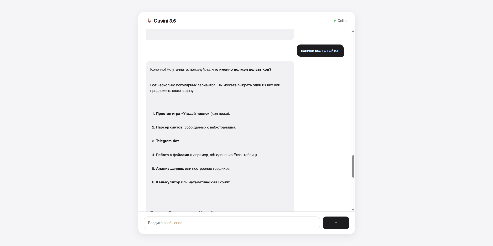

# 🪿 GusiniAI

<p align="center">

A modern AI assistant powered by Google Gemini with a custom FastAPI backend and an Apple-inspired user interface.

</p>

<p align="center">


</p>


## ✨ About

**GusiniAI** is a personal AI assistant built from scratch using Python and Google Gemini.

The project combines a modern web interface with a lightweight FastAPI backend to provide a simple and elegant AI chat experience.

The goal of GusiniAI is to create a clean, fast and extensible AI assistant architecture that can be improved with new features over time.


## 🚀 Features

### 💬 AI Chat
- Powered by Google Gemini API
- Fast response generation
- Conversation history storage

### 🎨 Modern Interface
- Apple-inspired minimalistic design
- Responsive layout
- Smooth animations
- Empty chat state
- Auto-growing input field

### 📝 Smart Message Rendering
- Markdown support
- Code blocks formatting
- Lists and headings
- Copy assistant responses

### ⚙️ Backend
- FastAPI REST API
- SQLAlchemy database layer
- Environment variable configuration
- Modular project structure


## 🖥️ Screenshots

<p align="center">



</p>


## 🏗️ Project Structure

```text
GusiniAI/

├── backend/
│
│   ├── main.py
│   ├── gemini_client.py
│   ├── db.py
│   ├── config.py
│   ├── requirements.txt
│   └── .env.example
│
├── frontend/
│
│   └── index.html
│
├── README.md
├── LICENSE
└── .gitignore
```

## 🛠️ Technologies

### Frontend

- HTML
- CSS
- JavaScript
- Markdown rendering


### Backend

- Python
- FastAPI
- SQLAlchemy
- Google Gemini API


### Database

- SQLite


## ⚡ Installation


### 1. Clone repository

```bash
git clone https://github.com/Shaurmasrepkoi/GusiniAI.git

cd GusiniAI
```


### 2. Create virtual environment

```bash
python -m venv .venv
```


Activate:

Windows:

```bash
.venv\Scripts\activate
```

Linux / macOS:

```bash
source .venv/bin/activate
```


### 3. Install dependencies

```bash
pip install -r backend/requirements.txt
```


### 4. Configure environment variables

Create:

```text
backend/.env
```

Add your Gemini API key:

```env
API_KEY=your_gemini_api_key
```


### 5. Run backend

```bash
cd backend

uvicorn main:app --reload
```


The API will start at:

```text
http://localhost:8000
```


### 6. Run frontend

Open:

```text
frontend/index.html
```

or use a local web server.


## 🔌 API Endpoints


### Get chat history

```http
GET /requests
```


### Send message

```http
POST /requests
```


Example:

```json
{
  "prompt": "Explain Python decorators"
}
```


Response:

```json
{
  "answer": "..."
}
```


## 🗺️ Roadmap

- [x] Gemini integration
- [x] FastAPI backend
- [x] Chat history
- [x] Modern UI
- [x] Markdown rendering
- [x] Copy messages

Future:

- [ ] Streaming responses
- [ ] User authentication
- [ ] PostgreSQL support
- [ ] Docker deployment
- [ ] Public cloud deployment


## 📄 License

This project is licensed under the MIT License.


## 👨‍💻 Author

Created by **Max Repka**


⭐ If you find this project interesting, consider giving it a star!